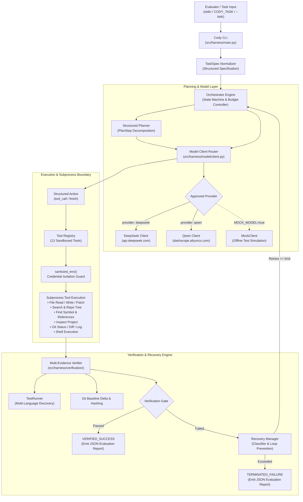

# Cody

**An autonomous AI coding harness that plans, edits, tests, verifies, and recovers inside a repository.**

<div align="center">

[](requirements.txt)
[](tests/)
[](.github/workflows/ci.yml)
[](config/config.yaml)
[](src/harness/tools/env.py)

[Overview](#1-what-is-cody) • [Key Capabilities](#2-why-cody) • [Architecture](#3-architecture) • [Execution Flow](#4-execution-flow) • [Model Providers](#5-model-providers) • [Credentials](#6-credential-handling) • [Quick Start](#7-quick-start) • [Evaluation Report](#9-evaluation-report-format)

</div>

---

## 1. What is Cody?

Cody is an autonomous AI coding harness engineered for automated programming evaluations and software engineering tasks. Given a problem statement or bug report, Cody inspects the target repository, formulates structured step-by-step implementation plans, executes surgical modifications across files, and validates changes against real test suites—operating end-to-end without manual intervention.

The harness is built around an explicit state machine coordinating model-driven planning, context prioritization, and tool dispatch. Cody inspects project structure, navigates symbols and references, and applies unified diffs or safe writes bounded to the workspace.

Reliability is driven by multi-evidence verification and targeted recovery. Cody does not blindly trust completion claims: it establishes pre-run git baselines, runs auto-discovered project tests, hashes modified files, and validates acceptance criteria. If execution or testing fails, an automated classifier categorizes the root cause, prevents repetitive loops, and guides targeted recovery cycles up to deterministic limits.

Cody enforces strict credential boundary isolation. Subprocesses executing in the target workspace receive a sanitized environment that strips evaluator credentials, ensuring API keys cannot leak to target repository code or subprocess logs.

---

## 2. Why Cody?

| Capability | Description |
|:---|:---|
| **Structured Planning** | Decomposes tasks into ordered plan steps with explicit files and verification goals prior to editing. |
| **Repository Awareness** | Discovers project build systems, maps symbols and references, and visualizes tree hierarchies before mutating files. |
| **Safe File Operations** | Guarantees bounded workspace containment, preventing symlink traversal, directory escapes, and corrupt patch states. |
| **Multi-Evidence Verification** | Combines git delta hashing, test runner execution, and acceptance criteria checking to confirm genuine task resolution. |
| **Targeted Recovery Loop** | Classifies failures (syntax, test, timeout, path error), detects repeated action loops, and applies corrective prompting. |
| **Credential Isolation** | Sanitizes subprocess environments so target-repository scripts and build commands cannot read evaluator API tokens. |
| **Approved Evaluation Providers** | Native support for hackathon-approved **DeepSeek** and **Qwen** model families with seamless runtime selection. |
| **Deterministic Safeguards** | Configurable execution limits (`max_iterations: 15`, `max_recovery_attempts: 3`, command timeouts) prevent runaway loops. |

---

## 3. Architecture

Cody decouples planning, model interaction, tool execution, and verification into modular components under strict security boundaries:



---

## 4. Execution Flow

Cody executes through a disciplined lifecycle governed by bounded iterations and failure recovery limits:


---

## 5. Model Providers

Evaluation is officially constrained to **DeepSeek** and **Qwen** model families. Cody enforces this boundary: only approved providers can be used during evaluation, and unsupported providers (such as OpenAI, Anthropic, Gemini, or Llama) are rejected immediately at startup.

All evaluation paths use **text-only** OpenAI-compatible chat completion interfaces (`/chat/completions`). No multimodal or vision dependencies exist.

### Approved Provider Matrix

| Provider | Default Model | Endpoint | Evaluation Status |
|:---|:---|:---|:---|
| **DeepSeek** | `deepseek-v4-flash` | `https://api.deepseek.com/chat/completions` | **Approved Evaluation Provider** |
| **Qwen** | `qwen-plus` | `https://dashscope.aliyuncs.com/compatible-mode/v1/chat/completions` | **Approved Evaluation Provider** |
| **Mock** | In-Memory Mock | Local Execution | **Offline Test Provider** (Not for evaluation) |

> [!IMPORTANT]
> **Evaluation Requirement Notice**: Final evaluation is restricted to DeepSeek and Qwen according to the organizer clarification. The organizers did not specify an exact model ID; Cody therefore keeps the model ID fully configurable within both approved provider families. `deepseek-v4-flash` and `qwen-plus` are Cody's configured defaults, not organizer mandates.

### Runtime Provider & Model Selection (Zero Code Modifications)

Switching between DeepSeek and Qwen requires **no source-code modifications**:

**Via Environment Variables (Recommended):**
```bash
# Evaluate with DeepSeek (default):
export AI_API_KEY="<EVALUATOR_KEY>"
make run

# Evaluate with Qwen:
export AI_API_KEY="<EVALUATOR_KEY>"
export CODY_PROVIDER="qwen"
# Optionally specify an exact Qwen model (defaults to qwen-plus):
export CODY_MODEL="qwen-max"
make run
```

**Via CLI Arguments:**
```bash
make run ARGS="--provider qwen --model qwen-plus"
```

Attempting to select an unsupported provider (e.g. `CODY_PROVIDER=openai`) fails immediately with a descriptive error:
```
Error: Unknown provider: 'openai'. Evaluation is restricted to approved providers: deepseek, qwen.
```

---

## 6. Credential Handling

Cody is designed with strict credential isolation boundaries to protect evaluator secrets:

```bash
# Standard evaluator credential interface:
export AI_API_KEY="<EVALUATOR_API_KEY>"
```

- **Single Primary Key**: The evaluator provides credentials through `AI_API_KEY`. Cody reads this directly in Python for model API calls.
- **Subprocess Environment Sanitization**: Every subprocess executed by Cody (`shell`, `file_search`, `repo_tree`, `apply_patch`, `git`, `test_runner`, `verifier`) passes through `sanitized_env()`.
- **Case-Insensitive Key Stripping**: `AI_API_KEY`, `DEEPSEEK_API_KEY`, `QWEN_API_KEY`, and IDE metadata prefixes (`ANTIGRAVITY_*`) are stripped before any child process is spawned. Target code cannot read evaluator secrets.
- **Zero Disk Exposure**: API keys are never written to configuration files, repository files, or logs.
- **Repository Cleanliness**: `.env` is gitignored and tracked repository files contain no hard-coded secrets.

---

## 7. Quick Start

### Standard Evaluator Workflow

Zero configuration or code modification is required. Clone, provide API key, set up, and run:

```bash
git clone https://github.com/alpha-sml/Cody.git
cd Cody
export AI_API_KEY="<PROVIDED_API_KEY>"
make setup
```

#### Run with task via **stdin** (Standard Evaluator Mechanism):
```bash
echo "Fix the authentication flow in login.py" | make run
```

#### Run with task via **`CODY_TASK`** environment variable:
```bash
export CODY_TASK="Fix the authentication flow in login.py"
make run
```

#### Run with task via **CLI arguments**:
```bash
make run ARGS="--task 'Fix the authentication flow in login.py'"
```

#### Run against an external repository:
```bash
make run ARGS="--task 'Resolve database leak' --repo /path/to/target/repo"
```

### Offline Mock Workflow (Testing & CI)

Run the full autonomous lifecycle offline without external network calls or token consumption:

```bash
echo "Fix the authentication flow" | AI_API_KEY="test-key" MOCK_MODEL=true make run
```

---

## 8. Tool Registry & Multi-Evidence Verification

### Tool Capabilities (13 Specialized Tools)

| Category | Tool | Description |
|:---|:---|:---|
| **Inspection** | `inspect_project` | Detects project languages, build systems, configs, and test runners |
| **Code Nav** | `find_symbol` | Locates definitions of classes, functions, and methods across workspace |
| **Code Nav** | `find_references` | Finds all usage occurrences and references of a symbol across files |
| **File I/O** | `file_read` | Bounded file reading with optional line range slicing |
| **File I/O** | `file_write` | Atomic safe file creation or overwrite within repository bounds |
| **File I/O** | `apply_patch` | Applies unified diffs using standard patch utilities with rollback safety |
| **Search** | `file_search` | High-performance text pattern search ignoring binaries and build artifacts |
| **Search** | `repo_tree` | Depth-bounded directory tree visualization |
| **Git** | `git_status` | Working tree status inspection |
| **Git** | `git_diff` | Tracked and untracked file diff generation |
| **Git** | `git_log` | Commit history inspection with output bounds |
| **Execution** | `shell` | Sandboxed command execution with sanitized credentials and timeouts |
| **Verification** | `run_test` | On-demand test execution using auto-discovered or configured test runner |

### Automatic Test Discovery Matrix

When no test command is specified, Cody automatically identifies test runners in order of precedence:

1. **Makefile**: `test` target &rarr; `make test`
2. **Node.js**: `package.json` (`scripts.test`) &rarr; `npm test`
3. **Python**: `pyproject.toml`, `pytest.ini`, `setup.cfg`, `tests/` directory &rarr; `pytest`
4. **Rust**: `Cargo.toml` &rarr; `cargo test`
5. **Go**: `go.mod` &rarr; `go test ./...`
6. **Java**: `pom.xml` &rarr; `mvn test` / `build.gradle` &rarr; `gradle test`
7. **Fallback**: `make test`

### Verification Status Codes

| Status Code | Meaning |
|:---|:---|
| `VERIFY_SUCCESS` | Project test suite passes and acceptance criteria are satisfied |
| `TEST_EXEC_FAIL` | Test runner exited with a non-zero exit code |
| `TEST_TIMEOUT` | Test execution exceeded configured timeout limit |
| `TEST_DISCOVER_FAIL` | Expected build tool or test runner was not found |
| `REPO_INSPECT_FAIL` | Working tree inspection encountered an error |

---

## 9. Evaluation Report Format

Upon task completion or termination, Cody prints a structured JSON evaluation summary to standard output:

```json
{
  "task": "Fix the authentication flow",
  "final_status": "success",
  "completion_status": "VERIFIED_SUCCESS",
  "changed_files": ["src/auth/login.py"],
  "model_provider": "deepseek",
  "model_name": "deepseek-v4-flash",
  "model_call_count": 3,
  "model_calls": {
    "planner": 1,
    "execution": 2,
    "recovery": 0
  },
  "tool_calls": 1,
  "verification_attempts": 1,
  "recovery_attempts": 0,
  "test_result": {
    "exit_code": 0,
    "status": "success",
    "tests_passed": true
  },
  "errors": []
}
```

---

## 10. Test Suite

Execute the comprehensive automated test suite (200 unit and integration tests):

```bash
make test
```

```
tests/
├── test_acceptance_verification.py  # Multi-evidence completion & baseline tests
├── test_client.py                   # Model provider client & API key fallback tests
├── test_context_priority.py         # Priority-budgeted context manager tests
├── test_credential_isolation.py     # Subprocess env credential stripping tests
├── test_discovery.py                # Multi-language test discovery matrix tests
├── test_evaluator.py                # End-to-end evaluator workflow smoke tests
├── test_higher_value_tools.py       # Code nav, project inspection, test runner tests
├── test_integration.py              # Full autonomous lifecycle integration tests
├── test_orchestrator.py             # Orchestrator state transitions & gates
├── test_recovery_targeted.py        # Failure classification & anti-loop tests
├── test_structured_planning.py      # Plan parser, lifecycle, and progression tests
├── test_tools.py                    # Sandboxed file, git, and shell tool tests
└── test_verification.py             # Verifier git hashing & status code tests
```
