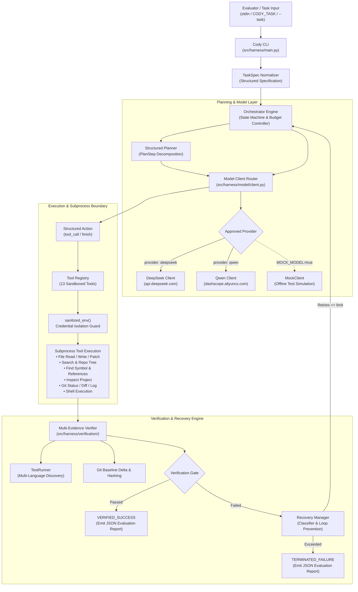
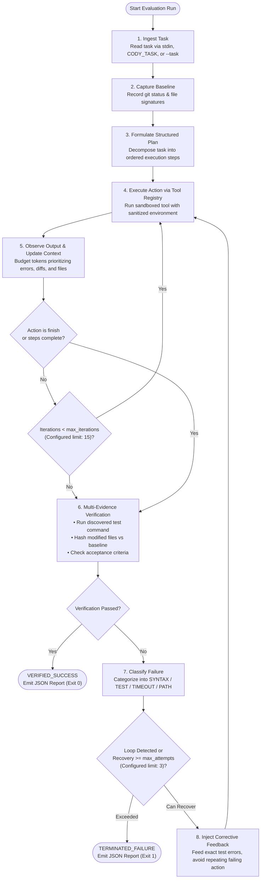

# Cody

**An autonomous AI coding harness that plans, edits, tests, verifies, and recovers inside a repository.**

<div align="center">

[](requirements.txt)
[](tests/)
[](.github/workflows/ci.yml)
[](config/config.yaml)
[](src/harness/tools/env.py)

[Overview](#1-what-is-cody) • [Architecture](#3-architecture) • [Model Providers & Precedence](#5-model-providers--configuration-precedence) • [Verification & Acceptance](#8-behavioral-acceptance-verification--completion-gate) • [Quick Start](#7-quick-start) • [Evaluation Report](#9-evaluation-report-format) • [Limitations](#11-system-limitations)

</div>

---

## 1. What is Cody?

Cody is an autonomous AI coding harness engineered for automated programming evaluations and software engineering tasks. Given a problem statement or bug report, Cody inspects the target repository, formulates structured step-by-step implementation plans, executes surgical modifications across files, and validates changes against real test suites—operating end-to-end without manual intervention.

The harness is built around an explicit state machine coordinating model-driven planning, context prioritization, and tool dispatch. Cody inspects project structure, navigates symbols and references, and applies unified diffs or safe writes bounded to the workspace.

Reliability is driven by multi-evidence verification and targeted recovery. Cody does not blindly trust completion claims: it establishes pre-run git baselines, runs auto-discovered project tests, hashes modified files, and validates acceptance criteria. If execution or testing fails, an automated classifier categorizes the root cause, prevents repetitive loops, and guides targeted recovery cycles up to deterministic limits.

Cody enforces strict credential boundary isolation. Subprocesses executing in the target workspace receive a sanitized environment that strips evaluator credentials, ensuring API keys cannot leak to target repository code or subprocess logs.

---

## 2. Why Cody?

| Capability | Description |
|:---|:---|
| **Structured Planning** | Decomposes tasks into ordered plan steps with explicit files and verification goals prior to editing. |
| **Repository Awareness** | Discovers project build systems, maps symbols and references, and visualizes tree hierarchies before mutating files. |
| **Safe File Operations** | Guarantees bounded workspace containment, preventing symlink traversal, directory escapes, and corrupt patch states. |
| **Multi-Evidence Verification** | Combines git delta hashing, test runner execution, and acceptance criteria checking to confirm genuine task resolution. |
| **Targeted Recovery Loop** | Classifies failures (syntax, test, timeout, path error), detects repeated action loops, and applies corrective prompting. |
| **Credential Isolation** | Sanitizes subprocess environments so target-repository scripts and build commands cannot read evaluator API tokens. |
| **Supported Evaluation Providers** | Native support for **DeepSeek** and **Qwen** model families with seamless runtime selection. |
| **Deterministic Safeguards** | Configurable execution limits (`max_iterations: 15`, `max_recovery_attempts: 3`, command timeouts) prevent runaway loops. |

---

## 3. Architecture

Cody decouples planning, model interaction, tool execution, and verification into modular components under strict security boundaries:



---

## 4. Execution Flow

Cody executes through a disciplined lifecycle governed by bounded iterations and failure recovery limits:



---

## 5. Model Providers & Configuration Precedence

Cody natively supports **DeepSeek** and **Qwen** model families for live evaluation. Unsupported providers (such as OpenAI, Anthropic, Gemini, or Llama) are rejected immediately at startup.

> **Important Evaluation Note:**
> Live evaluation requires an external model API. The evaluator supplies credentials at runtime through the environment (`AI_API_KEY`). The repository contains zero hard-coded credentials, and credentials are never stored on disk, logged, or exposed to subprocesses.
>
> **Mock Mode (`MOCK_MODEL=true` or `provider: mock`) is strictly for offline development and reproducible CI testing—it is not the final evaluation mode.**

All evaluation paths use **text-only** OpenAI-compatible chat completion interfaces (`/chat/completions`). No multimodal or vision dependencies exist.

### Provider Matrix

| Provider | Default Model | Default Endpoint | Endpoint Override | Evaluation Status |
|:---|:---|:---|:---|:---|
| **DeepSeek** | `deepseek-flash` | `https://api.deepseek.com` | `DEEPSEEK_BASE_URL` | **Supported Evaluation Provider** (Default) |
| **Qwen** | `qwen-plus` | `https://dashscope.aliyuncs.com/compatible-mode/v1` | `QWEN_BASE_URL` | **Supported Evaluation Provider** |
| **Mock** | In-Memory Mock | Local Execution | — | **Offline Test Provider** (Not for evaluation) |

### Configuration Precedence Order

Provider and model settings follow strict deterministic precedence:
1. **CLI Arguments**: `--provider <name>`, `--model <name>` (Highest precedence)
2. **Environment Variables**: `CODY_PROVIDER`, `CODY_MODEL` (and locked model `CODY_LOCKED_MODEL`)
3. **Locked Model / Provider Inference**: When `CODY_PROVIDER` is absent, the provider is inferred from the model name prefix (`deepseek-*` → deepseek, `qwen-*` → qwen).
4. **Configuration File**: `config/config.yaml` (`model.provider`, `model.name`) (Base default)

When a provider is overridden without explicitly specifying a model, that provider's default model is used (`deepseek-flash` for DeepSeek, `qwen-plus` for Qwen). Incompatible model/provider combinations are rejected immediately without silent substitution.

### Evaluator Model Overrides & Locked Model Enforcement

- **Arbitrary Evaluator Model Override**: If the evaluation committee supplies a specific model (e.g. `CODY_MODEL="deepseek-chat"` or `CODY_MODEL="qwen-turbo"` or `--model <name>`), Cody accepts any legitimate member of the provider's model family without requiring source code modifications.
- **`CODY_LOCKED_MODEL` Enforcement**: When set, Cody locks execution to the prescribed model:
  - Rejects conflicting model overrides from CLI arguments or `CODY_MODEL`.
  - Automatically infers the correct provider (`deepseek` or `qwen`) if `CODY_PROVIDER` is not explicitly set.
  - Never silently substitutes an incompatible model.

### Credential Resolution Precedence

1. **`AI_API_KEY`**: Primary evaluator standard credential (highest precedence). Read at runtime in Python memory; never written to disk or logged.
2. **`<PROVIDER>_API_KEY`**: Fallback provider-specific local development key (`DEEPSEEK_API_KEY` or `QWEN_API_KEY`).
3. **Endpoint Overrides**: `DEEPSEEK_BASE_URL` and `QWEN_BASE_URL` allow routing API calls through evaluator proxies or alternate gateways.

### Runtime Provider & Model Selection Examples

**Via Environment Variables (Standard Evaluator Mechanism):**
```bash
# Evaluate with DeepSeek (canonical default: deepseek-flash):
export AI_API_KEY="<EVALUATOR_KEY>"
make run

# Evaluate with Qwen (default: qwen-plus):
export AI_API_KEY="<EVALUATOR_KEY>"
export CODY_PROVIDER="qwen"
make run

# Evaluate with a specific Qwen model (infers CODY_PROVIDER=qwen automatically):
export AI_API_KEY="<EVALUATOR_KEY>"
export CODY_MODEL="qwen-plus"
make run

# Lock evaluation model (rejects conflicting overrides):
export AI_API_KEY="<EVALUATOR_KEY>"
export CODY_LOCKED_MODEL="deepseek-flash"
make run

# Override base URL (e.g. evaluator proxy gateway):
export QWEN_BASE_URL="https://proxy.example.com/qwen/v1"
make run
```

**Via CLI Arguments:**
```bash
make run ARGS="--provider qwen --model qwen-plus"
```

Attempting to select an unsupported provider (e.g. `CODY_PROVIDER=openai`) fails immediately with a descriptive error:
```
Error: Unknown provider: 'openai'. Supported evaluation providers are: deepseek, qwen.
```

---

## 6. Credential Handling & Security Isolation

Cody is designed with strict credential isolation boundaries to protect evaluator secrets:

```bash
# Standard evaluator credential interface:
export AI_API_KEY="<EVALUATOR_API_KEY>"
```

- **Single Primary Key**: The evaluator provides credentials through `AI_API_KEY`. Cody reads this directly in Python runtime memory for model API calls.
- **Zero Disk & Log Exposure**: Credentials are never written to repository files, configuration files, commit history, or stdout/stderr logs.
- **Subprocess Environment Sanitization**: Every subprocess executed by Cody (`shell`, `file_search`, `repo_tree`, `apply_patch`, `git`, `test_runner`, `verifier`) passes through `sanitized_env()`.
- **Comprehensive Credential Stripping**: Evaluator keys (`AI_API_KEY`, `DEEPSEEK_API_KEY`, `QWEN_API_KEY`), third-party tokens (`GITHUB_TOKEN`, `OPENAI_API_KEY`, bearer tokens, cloud secrets, passwords, private keys), and IDE metadata prefixes (`ANTIGRAVITY_*`) are stripped before any child process is spawned. Target repository code cannot read evaluator secrets.
- **Repository Cleanliness**: `.env` is gitignored and tracked repository files contain zero hard-coded secrets.

---

## 7. Quick Start

### Standard Evaluator Workflow

Zero source code configuration is required. Set API key in environment, install dependencies, and run:

```bash
export AI_API_KEY="your-api-key"
make setup
make run
```

#### Run with task via **stdin** (Standard Evaluator Mechanism):
```bash
echo "Fix the authentication flow in login.py" | make run
```

#### Run with task via **`CODY_TASK`** environment variable:
```bash
export CODY_TASK="Fix the authentication flow in login.py"
make run
```

#### Run with task via **CLI arguments**:
```bash
make run ARGS="--task 'Fix the authentication flow in login.py'"
```

#### Provider-Specific Execution:
```bash
# Evaluate with DeepSeek:
AI_API_KEY="$AI_API_KEY" CODY_PROVIDER=deepseek make run

# Evaluate with Qwen:
AI_API_KEY="$AI_API_KEY" CODY_PROVIDER=qwen make run
```

#### Run against an external repository:
```bash
make run ARGS="--task 'Resolve database leak' --repo /path/to/target/repo"
```

### Real API Smoke Test (Optional Live Verification)

To verify live provider connectivity without committing keys:

```bash
# 1. Smoke test DeepSeek live API:
AI_API_KEY="$AI_API_KEY" CODY_PROVIDER=deepseek make run ARGS="--task 'Verify system status'"

# 2. Smoke test Qwen live API:
AI_API_KEY="$AI_API_KEY" CODY_PROVIDER=qwen make run ARGS="--task 'Verify system status'"

# 3. Automated smoke test (opt-in; skips cleanly when credentials absent):
REAL_API_TEST=1 AI_API_KEY="$AI_API_KEY" make test TEST_ARGS="-k real_provider"
```

### Offline Mock Workflow (Testing & CI)

Run the full autonomous lifecycle offline without external network calls or token consumption:

```bash
echo "Fix the authentication flow" | AI_API_KEY="test-key" MOCK_MODEL=true make run
```

### Standard Makefile Interface

The repository provides standard high-level targets:

```bash
make setup  # Creates Python venv and installs dependencies
make run    # Launches Cody AI harness (supports ARGS="..." or stdin)
make test   # Executes the offline test suite (supports TEST_ARGS="...")
make clean  # Cleans venv, cache files, and build artifacts
```


---

## 8. Behavioral Acceptance Verification & Completion Gate

Cody rejects completion claims that lack concrete behavioral evidence. A task is **never** considered complete merely because a file was touched, existing tests happen to pass, or the model emitted `finish`.

### Behavioral Acceptance Verification Layer (`AcceptanceVerifier`)

The verification layer deterministically evaluates objective task criteria and returns one of three strict statuses:
- **`PASS`**: Concrete evidence validates the criterion (file exists and is non-empty, symbol exists via AST/regex, command executed with exit code 0, JSON parsed and validated, expected stdout substring confirmed).
- **`FAIL`**: Concrete evidence contradicts the criterion (file missing, symbol not defined, command exited non-zero, expected stdout missing).
- **`UNRESOLVED`**: The criterion is subjective, unverifiable offline, or lacks objective mechanical indicators. **Unresolved criteria are never assumed to pass.**

### Hardened Completion Gate

The final gate (`Orchestrator._completion_gate`) enforces 5 independent criteria:
1. **Tests Pass**: The repository test suite executes and exits 0 with zero failures.
2. **Repository Changed**: If the task requires mutations, Cody-attributed changes (`cody_files`) must be non-empty. Tasks claiming finish without meaningful changes fail with `NO_MEANINGFUL_CHANGE`.
3. **Expected Files Mutated**: Explicitly required files from the task specification must be changed. Missing required files fail with `REQUIRED_FILES_NOT_MODIFIED`.
4. **Unexpected Changes Detected**: Mutating files outside the expected scope fails with `UNEXPECTED_CHANGES`.
5. **Acceptance Criteria Verification**: Any `FAIL` criterion fails verification. Any `UNRESOLVED` criterion triggers `ACCEPTANCE_CRITERIA_UNRESOLVED`. Only fully satisfied criteria achieve `VERIFIED_SUCCESS`.

### Robust Workspace Baseline Tracking

Evaluators may launch Cody in dirty workspaces. Cody records an initial baseline snapshot (`git status --porcelain`, file hashes) and distinguishes:
- **Pre-existing changes**: Existed before Cody started; NOT attributed to Cody.
- **Cody-introduced changes**: Newly created files, modified tracked files with altered signatures, and deletions performed by Cody.
- **Transient Cache Filtering**: Build and test artifacts (`__pycache__`, `.pytest_cache`, `.coverage`, `.mypy_cache`, `.ruff_cache`, `.tox`, `*.pyc`, `*.pyo`, `.DS_Store`) are excluded to avoid false unexpected-change reports.

### Tool Registry (13 Sandboxed Tools)

| Category | Tool | Description |
|:---|:---|:---|
| **Inspection** | `inspect_project` | Detects project languages, build systems, configs, and test runners |
| **Code Nav** | `find_symbol` | Locates definitions of classes, functions, and methods across workspace |
| **Code Nav** | `find_references` | Finds all usage occurrences and references of a symbol across files |
| **File I/O** | `file_read` | Bounded file reading with optional line range slicing |
| **File I/O** | `file_write` | Atomic safe file creation or overwrite within repository bounds |
| **File I/O** | `apply_patch` | Applies unified diffs using standard patch utilities with rollback safety |
| **Search** | `file_search` | High-performance text pattern search ignoring binaries and build artifacts |
| **Search** | `repo_tree` | Depth-bounded directory tree visualization |
| **Git** | `git_status` | Working tree status inspection |
| **Git** | `git_diff` | Tracked and untracked file diff generation |
| **Git** | `git_log` | Commit history inspection with output bounds |
| **Execution** | `shell` | Sandboxed command execution with sanitized credentials and timeouts |
| **Verification** | `run_test` | On-demand test execution using auto-discovered or configured test runner |

### Automatic Test Discovery Matrix

When no test command is specified, Cody automatically identifies test runners in order of precedence:
1. **Makefile**: `test` target &rarr; `make test`
2. **Node.js**: `package.json` (`scripts.test`) &rarr; `npm test`
3. **Python**: `pyproject.toml`, `pytest.ini`, `setup.cfg`, `tox.ini`, `tests/` directory &rarr; `pytest`
4. **Rust**: `Cargo.toml` &rarr; `cargo test`
5. **Go**: `go.mod` &rarr; `go test ./...`
6. **Java**: `pom.xml` &rarr; `mvn test` / `build.gradle` &rarr; `gradle test`
7. **Fallback**: `make test`

---

## 9. Evaluation Report Format

Upon task completion or termination, Cody prints a structured JSON evaluation summary with complete audit evidence:

```json
{
  "task": "Fix the authentication flow in login.py",
  "final_status": "success",
  "completion_status": "VERIFIED_SUCCESS",
  "changed_files": ["login.py"],
  "evidence": {
    "repository_changed": "YES",
    "cody_files": ["login.py"],
    "expected_files_changed": "PASS",
    "unexpected_changes": "NONE",
    "tests": "PASS",
    "acceptance_criteria": "PASS",
    "completion": "VERIFIED_SUCCESS"
  },
  "acceptance_criteria": {
    "all_passed": true,
    "has_failures": false,
    "has_unresolved": false,
    "criteria_results": [
      {
        "criterion": "login.py exists",
        "status": "PASS",
        "evidence": "File exists: login.py (size: 420 bytes)"
      }
    ]
  },
  "model_provider": "deepseek",
  "model_name": "deepseek-flash",
  "model_call_count": 3,
  "model_calls": {
    "planner": 1,
    "execution": 2,
    "recovery": 0
  },
  "tool_calls": 2,
  "verification_attempts": 1,
  "recovery_attempts": 0,
  "test_result": {
    "exit_code": 0,
    "status": "success",
    "tests_passed": true
  },
  "errors": []
}
```

---

## 10. Test Suite

Execute the comprehensive automated test suite (245+ offline unit, integration, and adversarial tests):

```bash
make test
```


```
tests/
├── test_acceptance_verification.py  # Multi-evidence completion & baseline tests
├── test_adversarial_verification.py # 12 adversarial false-success rejection tests
├── test_classifier.py               # Failure classification unit tests
├── test_client.py                   # Model provider client & API key fallback tests
├── test_context.py                  # Context manager basic tests
├── test_context_priority.py         # Priority-budgeted context manager tests
├── test_credential_isolation.py     # Subprocess env credential stripping tests
├── test_discovery.py                # Multi-language test discovery matrix tests
├── test_evaluator.py                # End-to-end evaluator workflow smoke tests
├── test_explicit_states.py          # State machine transitions & recovery flow
├── test_higher_value_tools.py       # Code nav, project inspection, test runner tests
├── test_integration.py              # Full autonomous lifecycle integration tests
├── test_integration2.py             # Classifier end-to-end integration tests
├── test_main.py                     # CLI flags, stdin, and env var parsing tests
├── test_boundary_tools.py          # Tool schemas, patch applying, and model errors
├── test_orchestrator.py             # Orchestrator state transitions & gates
├── test_recovery_targeted.py        # Failure classification & anti-loop tests
├── test_state.py                    # State initialization tests
├── test_structured_planning.py      # Plan parser, lifecycle, and progression tests
├── test_tools.py                    # Sandboxed file, git, and shell tool tests
└── test_verification.py             # Verifier git hashing & status code tests
```

---

## 11. System Limitations

- **Text-Only Interfaces**: Cody exclusively uses text `/chat/completions` API endpoints. Multimodal image/audio inputs are not supported.
- **Provider Boundary**: Only **DeepSeek** and **Qwen** provider families are supported for live evaluation; offline test suites use the mock provider.
- **Deterministic Static Verification**: Symbol extraction uses Python AST parsing for Python files and regex fallback for other languages. Complex dynamic metaprogramming symbols may require explicit test suite coverage to establish verification.
- **Token Bounds**: Context is bounded to prevent token window overflow (`max_tokens: 32000`). Large repositories rely on search, symbol lookups, and prioritized retrieval rather than whole-repo inlining.
- **Iteration Limits**: Execution is deterministically bounded to `max_iterations: 15` and `max_recovery_attempts: 3` to prevent infinite loops.
- **Process Boundary & Tool Isolation**: Cody enforces workspace directory containment against path traversal escapes, command execution timeouts, and environment sanitization. It operates as a standard process and does not implement OS-level kernel virtualization (e.g. Docker or seccomp isolation).
