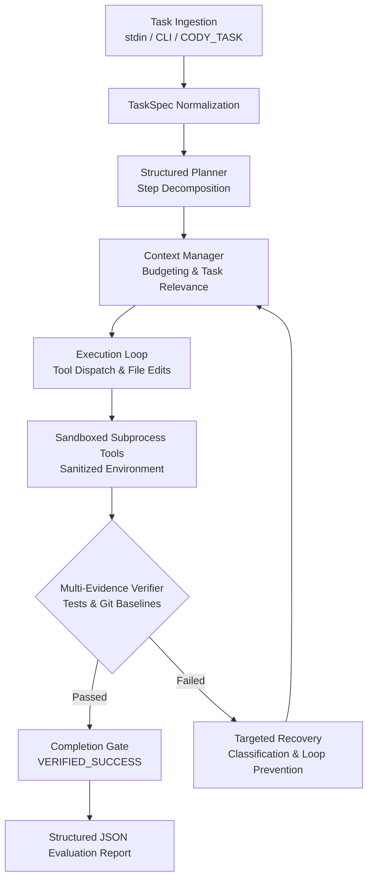
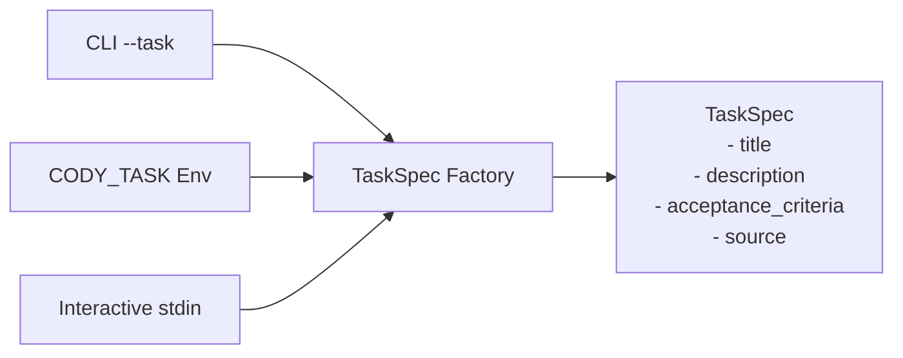

# Cody — Autonomous AI Coding Harness

[](.github/workflows/ci.yml)
[](requirements.txt)
[](tests/)
[](src/harness/tools/env.py)
[](src/harness/)

**Cody** is a production-grade autonomous AI coding agent designed for automated programming challenges and evaluation harnesses. It ingests ambiguous engineering tasks, formulates structured step-by-step plans, conducts safe workspace modifications, executes automated verification across multi-language projects, and autonomously recovers from errors — requiring zero manual intervention.

---

## 📑 Table of Contents

- [System Architecture](#-system-architecture)
- [Quick Start](#-quick-start)
  - [Evaluator Standard Run](#evaluator-standard-run)
  - [Alternative Task Ingestion](#alternative-task-ingestion)
  - [Local Development](#local-development)
- [Core Components](#-core-components)
- [Credential Security & Isolation](#-credential-security--isolation)
- [Model Configuration](#-model-configuration)
- [Tool Registry](#-tool-registry)
- [Task Ingestion Protocol](#-task-ingestion-protocol)
- [Verification & Acceptance Engine](#-verification--acceptance-engine)
- [Targeted Recovery Engine](#-targeted-recovery-engine)
- [Test Suite & Quality Assurance](#-test-suite--quality-assurance)

---

## 🏛 System Architecture

Cody operates via a deterministic, bounded state machine ensuring progress toward verified completion:



---

## 🚀 Quick Start

### Evaluator Standard Run

Zero configuration required. Clone, provide API key, set up, and run:

```bash
git clone <TEAM_REPOSITORY>
cd Cody
export AI_API_KEY="<PROVIDED_API_KEY>"
make setup
```

Run with task passed via **stdin**:
```bash
echo "Fix the authentication flow in login.py" | make run
```

### Alternative Task Ingestion

Via **`CODY_TASK`** environment variable:
```bash
export CODY_TASK="Fix the authentication flow in login.py"
make run
```

Via **CLI flag**:
```bash
make run ARGS="--task 'Fix the authentication flow in login.py'"
```

### Local Development

Run against a specific external target repository:
```bash
make run ARGS="--task 'Refactor database session pooling' --repo /path/to/target/repo"
```

> [!TIP]
> To run the offline simulation suite without external network calls or consuming tokens:
> ```bash
> echo "Fix the authentication flow" | AI_API_KEY="test-key" MOCK_MODEL=true make run
> ```

---

## 🧩 Core Components

| Component | Module | Purpose |
|:----------|:-------|:--------|
| **Orchestrator** | [`src.harness.orchestrator`](src/harness/orchestrator.py) | Central state machine coordinating Plan → Execute → Verify → Recover cycles |
| **Planner** | [`src.harness.planner`](src/harness/planner.py) | Decomposes task requirements into structured JSON plans with explicit verification criteria |
| **Context Manager** | [`src.harness.context`](src/harness/context/context_manager.py) | Priority-budgeted context compression prioritizing error traces, active files, and diffs |
| **Tool Registry** | [`src.harness.tools`](src/harness/tools/) | Read, write, search, AST inspection, test runner, and shell tools under security boundaries |
| **Verifier** | [`src.harness.verification`](src/harness/verification/) | Multi-evidence verification comparing git baselines, test outputs, and acceptance criteria |
| **Recovery** | [`src.harness.recovery`](src/harness/recovery/) | Failure categorization, repeated action loop prevention, and targeted corrective prompting |

---

## 🔒 Credential Security & Isolation

Cody enforces strict credential boundary isolation preventing target code from accessing or leaking secrets:

- **Primary Interface**: Evaluator credentials are passed via `AI_API_KEY`. Provider-specific keys (`DEEPSEEK_API_KEY`, `QWEN_API_KEY`) serve as development fallbacks.
- **Subprocess Environment Sanitization**: Every subprocess invocation (`shell`, `file_search`, `repo_tree`, `apply_patch`, `git`, `test_runner`, `verifier`) executes inside [`sanitized_env()`](src/harness/tools/env.py).
- **Prefix & Key Stripping**: Sensitive keys (`AI_API_KEY`, `DEEPSEEK_API_KEY`, `QWEN_API_KEY`) and IDE metadata prefixes (`ANTIGRAVITY_`) are stripped before spawning any child process.
- **Leakage Prevention**: API tokens are never written to disk, logged in execution records, or output to stdout. `.env` files are gitignored and protected against workspace inspection.

---

## ⚙️ Model Configuration

Evaluation is officially constrained to **DeepSeek** and **Qwen** model families. Cody enforces this boundary: only approved providers can be used during evaluation, and unsupported providers (e.g., OpenAI, Anthropic, Gemini) are rejected immediately at startup.

All evaluation paths use **text-only** OpenAI-compatible chat completion interfaces. No multimodal/image dependencies exist.

Configuration defaults reside in [`config/config.yaml`](config/config.yaml):

```yaml
model:
  # Supported evaluation providers: "deepseek" (default) or "qwen"
  name: "deepseek-v4-flash"
  provider: "deepseek"
  max_tokens: 8192
```

### Approved Evaluation Providers

| Provider | Base URL | Default Model | Configurable Models |
|:---------|:---------|:--------------|:--------------------|
| `deepseek` | `api.deepseek.com` | `deepseek-v4-flash` | `deepseek-v4-flash`, `deepseek-coder`, or any valid DeepSeek model ID |
| `qwen` | `dashscope.aliyuncs.com` | `qwen-plus` | `qwen-plus`, `qwen-max`, `qwen-turbo`, or any valid Qwen model ID |
| `mock` | Local In-Memory | N/A | Offline deterministic mock for CI and unit tests (`MOCK_MODEL=true`) |

### Switching Between Approved Providers (Zero Code Changes)

The evaluator supplies `AI_API_KEY` in the environment. Switching between DeepSeek and Qwen requires **no source modifications**:

**Option 1 — Environment Variables (Recommended):**
```bash
# To evaluate with DeepSeek (default):
export AI_API_KEY="<EVALUATOR_KEY>"
make run

# To evaluate with Qwen:
export AI_API_KEY="<EVALUATOR_KEY>"
export CODY_PROVIDER="qwen"
# Optionally specify model (defaults to qwen-plus):
export CODY_MODEL="qwen-max"
make run
```

**Option 2 — CLI Arguments:**
```bash
make run ARGS="--provider qwen --model qwen-max"
```

> [!NOTE]
> Attempting to select an unsupported provider (e.g. `CODY_PROVIDER=openai`) fails immediately with a clear configuration error.

---

## 🛠 Tool Registry

The harness equips the agent with 13 specialized tools categorized by operation type:

| Category | Tool | Description |
|:---------|:-----|:------------|
| **Inspection** | `inspect_project` | Detects project languages, build systems, configs, and test runners |
| **Code Nav** | `find_symbol` | Locates definitions of classes, functions, and methods |
| **Code Nav** | `find_references` | Finds all usage occurrences and references of a symbol across the workspace |
| **File I/O** | `file_read` | Reads file content with optional line ranges and truncation safety |
| **File I/O** | `file_write` | Atomic safe file creation or overwrite within repository bounds |
| **File I/O** | `apply_patch` | Applies unified diffs using standard patch utilities with rollback safety |
| **Search** | `file_search` | High-performance pattern searching across the workspace |
| **Search** | `repo_tree` | Depth-bounded directory tree visualization |
| **Git** | `git_status` | Working tree status inspection |
| **Git** | `git_diff` | Tracked and untracked file diff generation |
| **Git** | `git_log` | Commit history inspection with output bounds |
| **Execution** | `shell` | Sandboxed command execution with sanitized credentials and timeouts |
| **Verification** | `run_test` | On-demand test suite execution using auto-discovered test runners |

---

## 📥 Task Ingestion Protocol

Cody normalizes all incoming requests into a canonical [`TaskSpec`](src/harness/state.py) structure:



Evaluator tasks passed through standard input are processed immediately without interactive blocking.

---

## 🔍 Verification & Acceptance Engine

The completion gate applies a multi-dimensional verification barrier:

1. **Test Suite Execution**: Auto-discovers and executes project test commands with zero configuration.
2. **Repository Delta Tracking**: Hashes files against pre-execution baselines to detect concrete changes.
3. **Change Attribution**: Rejects runs claiming completion without tangible file changes or inspection evidence.
4. **Collateral Change Guard**: Flags unintended edits outside expected task scopes.
5. **Acceptance Criteria Validation**: Evaluates functional criteria specified in task requirements.

### Status Codes

| Status Code | Meaning |
|:------------|:--------|
| `VERIFY_SUCCESS` | All project tests pass and criteria are satisfied |
| `TEST_EXEC_FAIL` | Test runner exited with non-zero exit code |
| `TEST_TIMEOUT` | Test execution exceeded configured timeout limit |
| `TEST_DISCOVER_FAIL` | Expected build tool or test runner was absent |
| `REPO_INSPECT_FAIL` | Working tree inspection encountered an error |

### Automatic Test Discovery Matrix

When no test command is explicitly configured, Cody automatically identifies test runners in order of precedence:

```
1. Makefile (test target)      →  make test
2. package.json (scripts.test) →  npm test
3. Python configurations       →  pytest
   (pyproject.toml, pytest.ini, setup.cfg, tests/ directory)
4. Rust Cargo.toml             →  cargo test
5. Go go.mod                   →  go test ./...
6. Java Maven pom.xml          →  mvn test
7. Java Gradle build.gradle    →  gradle test
8. Default Fallback            →  make test
```

---

## 🔄 Targeted Recovery Engine

When a tool or test verification fails, Cody avoids blind repetition through targeted classification:

- **Failure Categorization**: Maps errors to `SYNTAX_ERROR`, `TEST_FAILURE`, `TIMEOUT`, `PATH_ERROR`, or `NO_MEANINGFUL_CHANGE`.
- **Loop Prevention**: Detects repeated identical tool invocations and forcibly redirects planning.
- **Context Injection**: Feeds targeted failure hints, compiler outputs, and exact failing assertions into the next planning cycle.

---

## 🧪 Test Suite & Quality Assurance

Run the comprehensive automated test suite:

```bash
make test
```

### Coverage Distribution (200 Automated Tests)

```
tests/
├── test_acceptance_verification.py  # Multi-evidence completion & baseline tests
├── test_client.py                   # Model provider client & API key fallback tests
├── test_context_priority.py         # Priority-budgeted context manager tests
├── test_credential_isolation.py     # Subprocess env credential stripping tests
├── test_discovery.py                # Multi-language test discovery matrix tests
├── test_evaluator.py                # End-to-end evaluator workflow smoke tests
├── test_higher_value_tools.py       # Code nav, project inspection, test runner tests
├── test_integration.py              # Full autonomous lifecycle integration tests
├── test_orchestrator.py             # Orchestrator state transitions & gates
├── test_recovery_targeted.py        # Failure classification & anti-loop tests
├── test_structured_planning.py      # Plan parser, lifecycle, and progression tests
├── test_tools.py                    # Sandboxed file, git, and shell tool tests
└── test_verification.py             # Verifier git hashing & status code tests
```

---

## 📊 Evaluation Output Format

Upon task completion or termination, Cody prints an evaluation payload to standard output:

```json
{
  "task": "Fix the authentication flow",
  "final_status": "success",
  "completion_status": "VERIFIED_SUCCESS",
  "changed_files": ["src/auth/login.py"],
  "model_provider": "deepseek",
  "model_name": "deepseek-v4-flash",
  "model_call_count": 3,
  "model_calls": {
    "planner": 1,
    "execution": 2,
    "recovery": 0
  },
  "tool_calls": 1,
  "verification_attempts": 1,
  "recovery_attempts": 0,
  "test_result": {
    "exit_code": 0,
    "status": "success",
    "tests_passed": true
  },
  "errors": []
}
```
